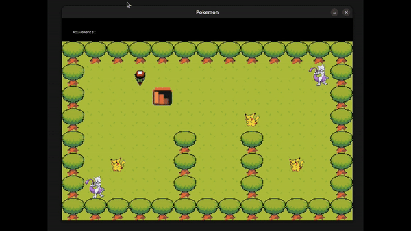
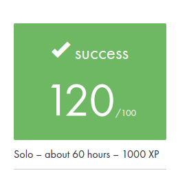

#  This project is part of my cursus at School 42 



## 📋 Project Overview

Welcome to my **So_Long** based on Pokemon, a small 2D game developed in C using the MiniLibX graphical library. The game challenges the player to collect all items on the map and find the exit while navigating through a maze of obstacles (I also implemented ennemies as Mewtoo). The project is part of the 42 School curriculum and focuses on learning essential concepts of graphics, event handling, and memory management in C.

The game features simple yet enjoyable gameplay, requiring strategic moves to reach the goal. It supports smooth graphical rendering and keyboard event handling using the MiniLibX library.

The project is compatible with Unix-based systems (Linux, macOS).

[Minilibx.doc](https://harm-smits.github.io/42docs/libs/minilibx)

## 🚀 Features

- Top-down 2D view with smooth sprite rendering.
- Use WASD or arrow keys for movement.
- Count the moves displayed in the terminal as the player progresses.
- Supports loading custom maps defined in .ber format.
- Enemies: Add patrols that make the player lose if touched.
- On-screen Move Counter: Display the move count directly on the game screen.

## 🛠️ How to Use

Clone the repository and Compile the project
```bash
git clone https://github.com/thibault-deverge/42-Cursus__So-long so_long
cd so_long
make
```

Run the game with a map:
```bash
./so_long maps/valid/map2.ber
```

- **W/A/S/D or Arrow Keys** - Move up, left, down, right
- **ESC** - Quit the game

## 📜 Map Format

The game reads maps from .ber files. These maps consist of:

- 1 - Wall
- 0 - Empty space
- C - Collectible
- E - Exit
- P - Player's starting position

Example simple map:
```
111111
1P0C01
100001
1C00E1
111111
```

There are valids and non-valid maps inside the maps folder to try out.


## Rating

